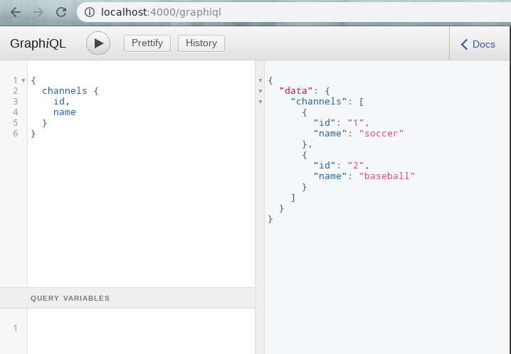
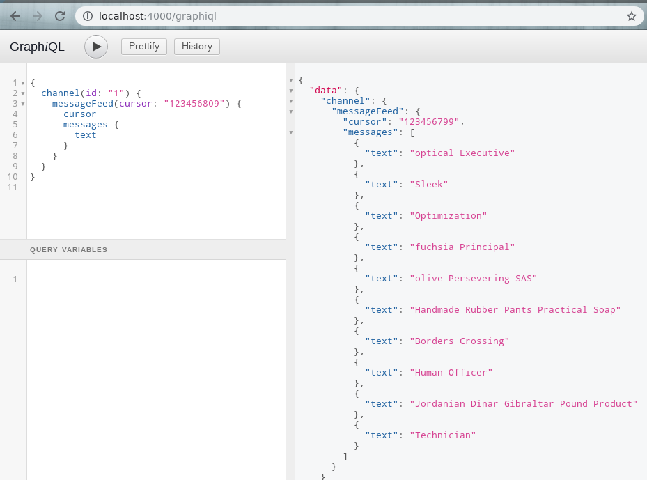

# Express server + GraphQL using Apollo libs #

This is the back-end that is part of the [react-graphql-with-apollo-client](../../../) project.

Author: [Francis Rodrigues][1]

## Dependencies version

* NPM libs
  * `express@^4.16.4`
  * `body-parser@^1.18.3`
  * `cors@^2.8.5`
*  React libs
  * `react@^16.8.2`
  * `react-dom@^16.8.2`
  * `react-scripts@^2.1.8`
*  GraphQL libs
  * `graphql@^14.2.1`
  * `graphql-server-express@^1.4.0`
  * `graphql-tools@^4.0.4`

## Starting the server application

First, you need to install the npm dependencies:

```bash
~$ npm install
```

and then start the server application:

```bash
~$ node index.js

Express Server is running on http://localhost:4000
```

Your React + GraphQL application can now access the link http://localhost:4000/graphql by Apollo client :ok_hand:

### Using GraphiQL tool

Now that you start successfully the server application, you can access directly the link http://localhost:4000/graphiql by browser and use the `Graphiql` in-browser IDE for exploring GraphQL.

**Channel list:**



**Message feed with cursor:**



You can read more about [GraphiQL here][2]

## License

MIT

  [1]: https://github.com/francisrod01
  [2]: https://github.com/graphql/graphiql
